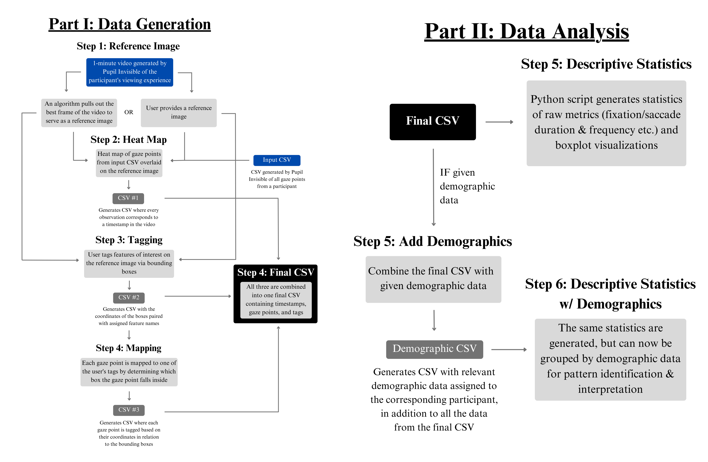

# Generalized Framework for Gaze Tracking
This repo is the work done by Team 19: Neurocities and Ruinscapes, as part of the Data+ internship at Duke University. We (Aditya, April and Eric) present a generalized framework that can be applied to any gaze tracking dataset that contains a gaze video along with an accompanying CSV of gaze points. 

We have utilized a wide array of image processing and statistical techniques to create the entire framework. 

# Framework Overview

1. **Reference Image Finder**
    - In case the user provides a reference image this step is skipped. 
    - If not, the script runs through all the videos and chooses the best frame with the minimal Mean Squared Error. 

2. **Heatmap**
    - Maps all the gaze points from the video onto the reference image (accouting for shift in scale, roation and prespective) using ORB (feature detector) with homography to perform this task. 
    - This also (typically) performs downsampling, as the input data is usually in nanoseconds while the output is in milliseconds (openCV constraints). 
    - The gaze points for both the raw data and the corresponding coordinates on the reference image are plotted under the qc_heatmap folder inside heatmap, which can be used to cross reference the quality of the matching.

    - **Scanpath Visualization**
        - The next step is the scanpath visualization. Two kinds of visualizations are done. 
            - Video: The gaze points are plotted on the actual video using the raw data. 
            - Reference Image: The gaze points are plotted (as a video) on the reference image using the output from the heatmap. 

3. **Tagging**
    - The user tracks various features of interest onto the reference image by using bounding boxes and labels them.
          - This is accomplished by using the left mouse button to begin the capture and the right button to finalize said capture.
          - The user also labels the feature after each successive capture and then presses enter to continue capturing. 
          - The user can also reset the capture session by pressing the "5" key or finish it by pressing the "9" key.
    - Any gaze point, coming from the updated csv with the mapped gaze points, found within the labeled boxes acquires the tag from said box.
          - If boxes overlap, the labeled, bounding box with the centroid closest to the gaze point is chosen as the tag of that gaze point.
    - This can be used to (in case of the Truscan couple statue) to generate metrics like how long the participant looked at the male face vs the female face. 
    - All these outputs or tagged csvs are then merged into one csv file at the end. 

4. **Descriptive Statistics**
    - Using the tagged data, various descriptive statistics such as time spent looking at features, comparative analysis are performed. 

    - **Demographic Data**
        - If Demographic data is present, the analysis is extended to include demographic features such as gender, education and age. 
        - The boxplots will have an additional demographic dimension.

# Steps to run the framework: 

1. **Data Preparation (Sample data in the required format provided in this repo)**
    - Create a data folder in your root path. 
    - Create a folder for the specific experiment you are organizing. Ensure that this name matches what is present in the art piece in the config.py file. 
    - Place all the separate participants within this specific folder. 
    - If you have a reference image you wish to plot the heatmap on, place said image in the same folder.
      

2. **Running all the scripts**
    - Changes to config.py file 
        - Add a new user for yourself. 
        - To use the default framework, inherit variables from the base class (which, if required, can be overwritten). 

    - To run the entire framework: bash run_scripts.sh $user
    - To run individual scripts (the same patterns follow for all)
        - cd heatmap [or the other functions]
        - python main.py $user
